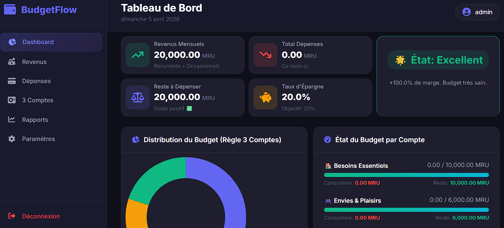

# 💰 BudgetFlow

> Système intelligent de gestion de budget personnel basé sur la **règle des 3 comptes** (50/30/20)

[](https://www.python.org/)
[](https://flask.palletsprojects.com/)
[](LICENSE)

---

## 📖 Table des matières

- [Fonctionnalités](#-fonctionnalités)
- [Aperçu](#-aperçu)
- [Installation](#-installation)
- [Utilisation](#-utilisation)
- [Structure du projet](#-structure-du-projet)
- [Configuration](#-configuration)
- [Sécurité](#-sécurité)
- [Technologies](#-technologies)
- [Contribuer](#-contribuer)
- [Licence](#-licence)

---

## ✨ Fonctionnalités

### 📊 Tableau de bord financier
- **KPIs en temps réel** : Revenus, dépenses, reste à dépenser, taux d'épargne
- **État du budget** : Indicateur visuel (Excellent/Stable/Attention/Critique)
- **Graphiques interactifs** : Camembert, barres, courbes (Chart.js)
- **Conseils personnalisés** : Analyse automatique et recommandations

### 💵 Gestion des revenus
- **Sources récurrentes** : Salaire, freelance, locations, pensions
- **Périodicité configurable** : Mensuel, hebdomadaire, bimensuel, trimestriel, annuel
- **Revenus occasionnels** : Ventes, primes, cadeaux, remboursements
- **Calendrier annuel** : Validation des revenus (débloqué à partir du 25 du mois)
- **Date de début** : Suivi précis depuis le démarrage de chaque source

### 💳 Gestion des dépenses
- **Catégorisation** : Alimentation, logement, transport, santé, loisirs, etc.
- **Règle des 3 comptes** : Attribution automatique (Besoins/Envies/Épargne)
- **Dépenses récurrentes** : Suivi des abonnements et charges fixes
- **Notes détaillées** : Contexte et commentaires

### 🏦 Système des 3 comptes (50/30/20)
- **🏠 Besoins essentiels (50%)** : Loyer, factures, alimentation, transport
- **🎮 Envies & plaisirs (30%)** : Sorties, shopping, loisirs, voyages
- **💰 Épargne (20%)** : Précaution, projets, investissements, retraite
- **Solde cumulatif** : Historique complet des revenus validés - dépenses
- **Barres de progression** : Visualisation de l'utilisation de chaque compte

### 💸 Gestion des dettes & créances
- **Dettes** : Prêts, crédits, emprunts (je dois)
- **Créances** : Argent prêté (on me doit)
- **Intérêts configurables** : Calcul automatique du montant total
- **Paiements uniques** : Validation avec mise à jour automatique
- **Statut dynamique** : En cours / Payé ou Remboursé
- **Intégration auto** : Ajout aux dépenses/revenus lors du paiement

### 🔐 Authentification & Sécurité
- **Login sécurisé** : Session Flask avec secret key
- **Rôles utilisateurs** : Admin / Utilisateur standard
- **Protection API** : Toutes les routes protégées par décorateur
- **Validation serveur** : Double vérification (client + backend)

### 📱 Responsive Design
- **Desktop** : Interface complète avec sidebar
- **Tablette** : Adaptation automatique
- **Mobile** : Navigation optimisée, tableaux scrollables

---

## 🎯 Aperçu

### Dashboard


### Calendrier des revenus


### Gestion des dettes


---

## 🚀 Installation

### Prérequis
- Python 3.8 ou supérieur
- pip (gestionnaire de paquets Python)
- Un navigateur web moderne

### Étapes d'installation

1. **Cloner le repository**
```bash
git clone https://github.com/votre-utilisateur/BudgetFlow.git
cd BudgetFlow
```

2. **Créer un environnement virtuel**
```bash
# Windows
python -m venv venv
venv\Scripts\activate

# macOS/Linux
python3 -m venv venv
source venv/bin/activate
```

3. **Installer les dépendances**
```bash
pip install -r requirements.txt
```

4. **Lancer l'application**
```bash
python app.py
```

5. **Accéder à l'application**
Ouvrez votre navigateur et allez sur : **http://127.0.0.1:5000**

---

## 📖 Utilisation

### Première connexion
- **Identifiant** : `admin`
- **Mot de passe** : `admin123`

⚠️ **Important** : Changez le mot de passe par défaut immédiatement après la première connexion !

### Workflow recommandé

1. **Configurer les paramètres** (règle 50/30/20 personnalisable)
2. **Ajouter vos sources de revenus** (avec date de début)
3. **Valider les revenus** chaque mois (à partir du 25)
4. **Enregistrer vos dépenses** au fur et à mesure
5. **Suivre l'état des comptes** sur le dashboard
6. **Gérer dettes et créances** si nécessaire

### Astuces
- 📅 **Calendrier** : Les mois futurs sont verrouillés, le mois courant est accessible à partir du 25
- 💡 **Conseils** : Consultez la section conseils pour optimiser votre budget
- 📊 **Rapports** : Exportez vos données pour analyse approfondie

---

## 📁 Structure du projet

```
budget_flow/
├── app.py                      # Application Flask principale
├── requirements.txt            # Dépendances Python
├── README.md                   # Documentation
├── .gitignore                  # Fichiers ignorés par Git
│
├── data/                       # Base de données JSON (non versionné)
│   ├── users.json             # Utilisateurs et authentification
│   ├── config.json            # Configuration (règles, devise)
│   ├── revenus_sources.json   # Sources de revenus récurrents
│   ├── revenus_occasionnels.json
│   ├── depenses.json          # Dépenses enregistrées
│   ├── validations_revenus.json
│   └── creances_dettes.json   # Dettes et créances
│
├── static/
│   ├── css/
│   │   └── style.css          # Styles personnalisés
│   └── js/
│       └── dashboard.js       # Scripts JavaScript (optionnel)
│
└── templates/
    ├── base.html              # Template de base
    ├── login.html             # Page de connexion
    ├── dashboard.html         # Tableau de bord principal
    ├── revenus.html           # Gestion des revenus
    ├── depenses.html          # Gestion des dépenses
    ├── comptes.html           # Vue des 3 comptes
    ├── rapports.html          # Rapports et historique
    └── parametres.html        # Configuration
```

---

## ⚙️ Configuration

### Personnalisation des règles
Par défaut : **50% Besoins / 30% Envies / 20% Épargne**

Modifiez dans `Paramètres` ou directement dans `data/config.json` :
```json
{
  "rules": {
    "besoins": 50,
    "envies": 30,
    "epargne": 20
  },
  "devise": "€",
  "nom_utilisateur": "Votre Nom"
}
```

### Devise supportée
- € Euro (défaut)
- $ Dollar
- £ Livre sterling
- DH Dirham marocain
- FC Franc CFA
- Toute autre devise (modification manuelle)

---

## 🔒 Sécurité

### Bonnes pratiques

1. **Changer le mot de passe par défaut**
```bash
# Modifier directement dans data/users.json après première connexion
```

2. **Secret Key de session**
Pour la production, utilisez une variable d'environnement :
```python
app.secret_key = os.environ.get("SECRET_KEY", secrets.token_hex(32))
```

3. **Ne jamais commiter le dossier `data/`**
Le `.gitignore` est configuré pour l'exclure automatiquement.

4. **Sauvegardes régulières**
Copiez périodiquement le dossier `data/` vers un emplacement sécurisé.

5. **HTTPS en production**
Utilisez un reverse proxy (Nginx/Apache) avec certificat SSL.

---

## 🛠️ Technologies utilisées

| Technologie | Version | Description |
|-------------|---------|-------------|
| **Flask** | 3.0+ | Framework web Python léger |
| **Chart.js** | 4.4+ | Visualisation de données |
| **SweetAlert2** | 11+ | Alertes et confirmations modernes |
| **Font Awesome** | 6.5+ | Icônes vectorielles |
| **Google Fonts** | Inter | Typographie moderne |
| **JSON** | - | Base de données légère |

---

## 🤝 Contribuer

Les contributions sont les bienvenues ! Voici comment participer :

1. **Fork** le projet
2. **Créez une branche** (`git checkout -b feature/AmazingFeature`)
3. **Committez** vos changements (`git commit -m 'Ajout AmazingFeature'`)
4. **Push** vers la branche (`git push origin feature/AmazingFeature`)
5. **Ouvrez une Pull Request**

### Guidelines
- Respectez la structure du projet
- Commentez votre code
- Testez vos modifications
- Mettez à jour le README si nécessaire

---

## 📝 Licence

Distribué sous la licence **MIT**. Voir `LICENSE` pour plus d'informations.

---

## 📞 Support

- 📧 Email : medcapt66@gmail.com
- 💬 Issues : [GitHub Issues](https://github.com/hamodouba/BudgetFlow/issues)
- 📖 Documentation : Ce README

---

## 🙏 Remerciements

- **Chart.js** pour les graphiques interactifs
- **SweetAlert2** pour les modales élégantes
- **Font Awesome** pour les icônes
- La communauté Flask

---

<div align="center">
  <strong>Made By Ba Mohamadou</strong><br>
  <sub>Si ce projet vous aide, pensez à mettre une ⭐ sur GitHub !</sub>
</div>

---
